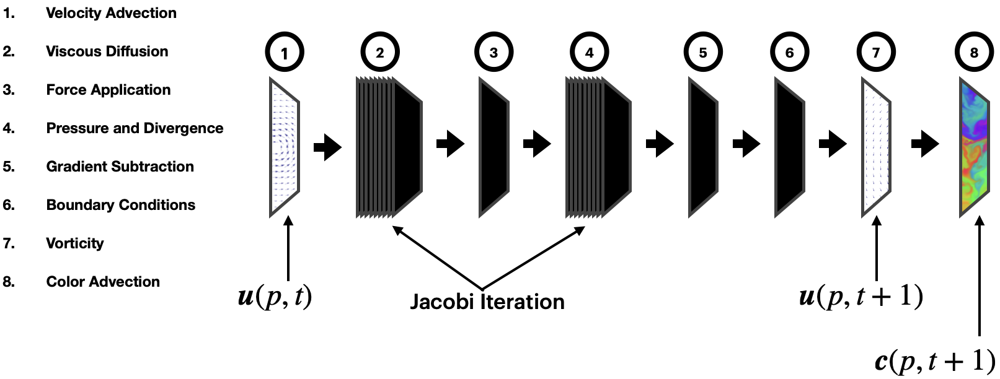

Before we discuss the details here is a [demo](/fluids). You can find the code for it on my github [here](https://github.com/sanjayyepuri/fluids).

### Navier-Stokes Equations for Incompressible Flow

Fluids are mathematically represented as vector fields; the vector field $$\boldsymbol{u}(p, t)$$ represents the velocity of the fluid at the point $$p$$ at time $$t$$. Now, in order for the fluid created by $$\boldsymbol{u}$$ to resemble one in our world the vector field must satisfy the Navier-Stokes equations for Incompressible Flow.

$$
\text{(1) }\frac{\partial \boldsymbol{u}}{\partial t} = -( \boldsymbol{u} \dot{} \nabla) \boldsymbol{u} - \frac{1}{\rho}\nabla \boldsymbol{p} + \nu \nabla^2 \boldsymbol{u} +  \boldsymbol{F} \\
\text{(2) }\nabla \dot{} \boldsymbol{u} = 0
$$

