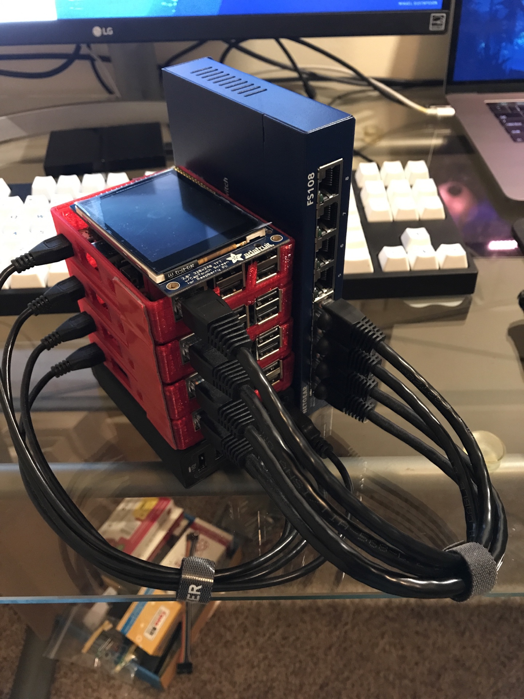
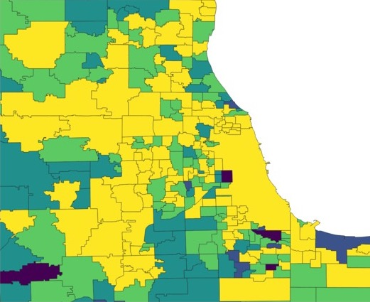
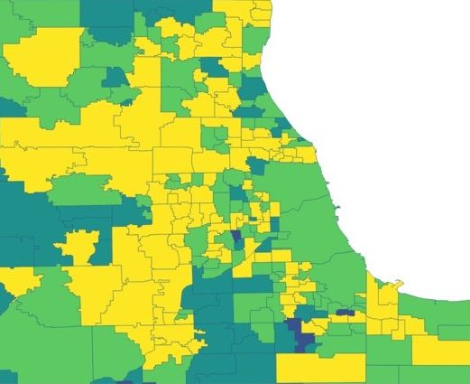

A year ago at a hackathon called Epsilon Hacks, my teammate, Mihir, and I were demoing what we called the "GerryAI." Essentially it was a machine learning model that would serve to redraw school district lines in the US to increase the diversity of each district and to prevent any racial bias.

<!-- During spring break I decided to build a Pi cluster and have my own distributed computing test platform. I wanted to be able test various algorithms related to distributed systems (and maybe while it’s idle run a server or use it as a network share for our apartment). This was pretty different from the ideal of having the “cloud on your desk,” but it’ll be an interesting project. -->

## What Does it Do?
GerryAI has been trained to look at a set of school districts and look at their Ethnic Diversity Index. The Ethnic Diversity Index is intended to measure how much "diversity" or "variety" a school or district has among the ethnic groups in its student population. More specifically, the Index reflects how evenly distributed these students are among the race/ethnicity categories and is used by many states including California. Please refer to [here](https://www.ed-data.org/article/Ethnic-Diversity-Index) for more information on how the calculation is made. Using this data, GerryAI will create predictions for how to combine or split districts to create more diverse districts.

### Data and Frameworks
For our data, we used this [source](https://www.cde.ca.gov/ds/ad/downloadabledata.asp) for the diversity data for all of the school districts in the nation. Our shapefile for the districts came from [The National Center for Education Statistics' Education Demographic and Geographic Estimates (EDGE) dataset](https://nces.ed.gov/programs/edge/Geographic/DistrictBoundaries). Finally, using the TensorFlow models and many trial-and-errors models, we were able to get the model to decently combine and separate the districts.

## What I Learned
We learned to combine datasets, use the free open-source QGIS (which was completely new), and to train a model on a very complicated problem. The datasets combination was done by Mihir, which took much of our time. I learned to create joins between CSV files and shapefiles and using the attributes in the CSV file to apply a color scale to the map. Finally, with training the model, I continued to build on my experience with creating, tweaking, and using data analysis techniques to bring out trends in data.

<!-- After I had looked online at other Pi clusters (such as this [one](https://makezine.com/projects/build-a-compact-4-node-raspberry-pi-cluster/) on Makezine), I decided I needed around 4-5 Raspberry Pis, a USB charging hub, and a network switch. Most any USB hubs and network switches should do; here are the specific ones that I bought. -->

<!-- * 5x Raspberry Pi 3 B+
* 1x Anker 7 port USB Charging Hub
* 1x Netgear FS108 8-port Network Switch
* 5x 6in. Ethernet Cables
* 5x 6in. MicroUSB Cables
* 5x 16GB microSD cards -->

<!-- I then 3D printed [this](https://www.thingiverse.com/thing:1573414) stackable chassis for the Pis which I attached to the switch using a special permanent 3M tape. The end result was a little messy because I had run out of plastic towards the end of the print however the cluster was still functional. In fact this had allowed me to later borrow a friends Pi screen to attach to the top of the cluster (the cherry on top). This is how it turned out:

 -->

## The Results
We accomplished the following:

* creating a combined dataset for calculating EDI
* compiling all the data into a single CSV with FIPS, LEAID, and EDI information
* using the single CSV to create the original map
* creating and training a basic model
* running the model on a test case

### Before and After Comparison

This comparison will show the changes made by the AI in the district boundaries for Chicago and the surrounding area.
 

## Next Steps
The next steps would be to optimize the model, increase its capabilities, open the inputs to GeoJSON files and other formats. We also want to use different metrics to determine district merges, including financial data, staff metrics, and special needs education capabilities. In addition to new data and methods, we want to make this project accessible, so that findings can be easily transferred to political changes to school districts. There are very few precedents to this change and that is exactly why we start now.

## What's Next?
Thank you for reading my first post on my website. Hopefully, you found it interesting. In the next post, I will be working on creating my own dark mode pdf viewer based on the Nord Theme and possibly the Dracula theme to finish off my quest to never look at light mode again.
